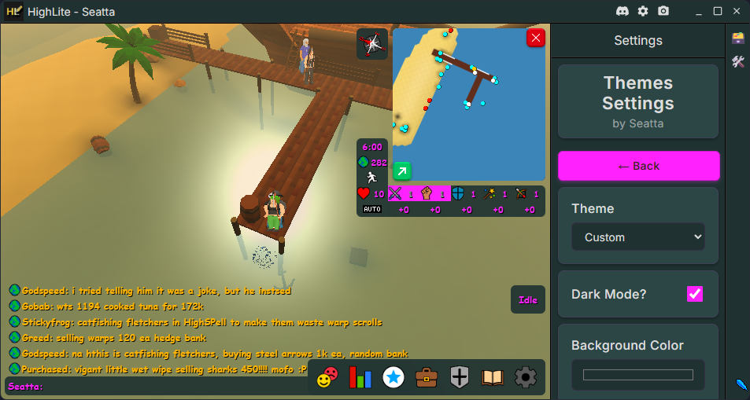

<div align=center>

<br><br>

# Highlite Plugins Repository

A repository for [Highlite][highlite-website] plugins based on
the [Highlite Example Plugin Template][example-plugin-repo]

## Plugins

<details><summary> 
ClientThemes - Restyle your HighLite client

--- 
</summary>

Allows the user to change HighLite and HighSpell themes.<br>
Supports creation, exporting, and exporting of user-defined themes as well as custom CSS.

<br><br>

---
</details>

## Information

<details><summary>Project Structure

---
</summary>

<div align=left>

```
Example-Plugin/
├── src/
│   ├── Example-Plugin            # Plugin directory
│   │   ├── Example-Plugin.ts     # Main plugin class
│   │   ├── types.d.ts            # Type declarations for static resources
│   │   ├── package.json          # Plugin configuration
│   │   └── resources/
│   │       ├── css/
│   │       │   └── base.css      # Stylesheet for the plugin
│   │       ├── html/
│   │       │   └── html.html     # HTML template
│   │       ├── images/
│   │       │   └── image.png     # Example image asset
│   │       └── sounds/
│   │           └── sound.mp3     # Exammple audio asset
│   │
│   ├── Example-Plugin-2          # Plugin directory
│   │   └── ...                   # Plugin files
│   │
│   └── Example-Plugin-3          # Plugin directory
│       └── ...                   # Plugin files
│
├── package.json                  # Project configuration and dependencies
├── rollup.config.mjs             # Build configuration
├── tsconfig.json                 # TypeScript configuration
└── README.md                     # This file
```

</div>


---

</details>

</div>

[highlite-website]: https://www.highlite.dev/

[highlite-repo]: https://github.com/Highl1te/HighliteDesktop

[core-repo]: https://github.com/Highl1te/Core

[example-plugin-repo]: https://github.com/Highl1te/Example-Plugin
