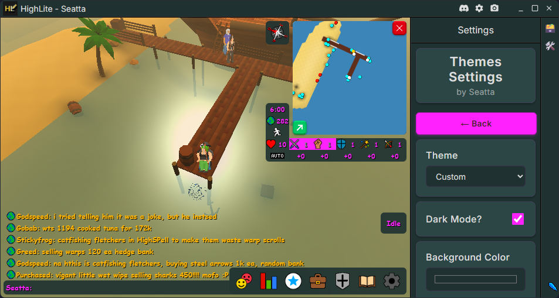

# Seatta's HighLite Plugins

A repository for [Highlite][highlite-website] plugins based on
the [Highlite Example Plugin Template][example-plugin-repo]

## Plugins

 
ClientThemes - Restyle HighLite!

---
Allows players to change HighLite and HighSpell themes and apply custom CSS. 
Supports importing and exporting of the custom user-defined theme.

  

---

[//]: # (Insert plugin templates below this)

 

[highlite-website]: https://www.highlite.dev/

[highlite-repo]: https://github.com/Highl1te/HighliteDesktop

[core-repo]: https://github.com/Highl1te/Core

[example-plugin-repo]: https://github.com/Highl1te/Example-Plugin

[//]: # (Plugin section template)
<!--- 

PLUGIN NAME - SHORT DESCRIPTION!

---
LONG DESCRIPTION

  

---

-->
